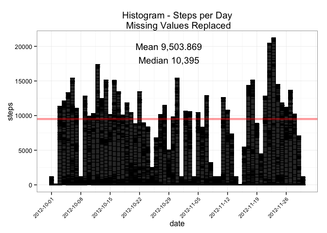

# Reproducible Research: Peer Assessment 1


## Loading and preprocessing the data

* Read in the data from the web site, and load it into variable activities. 
* Add a "timestamp field so that it will be easy to analyze "


```r
source("downloadData.R")
library(dplyr,quietly=TRUE)
library(ggplot2)
library(scales)
library(lubridate)
library(knitr)
activities$date<-as.Date(activities$date)
activities$timestamp<-as.POSIXct(paste(as.character(activities$date),sprintf("%00.4i",activities$interval),sep=" "),format="%Y-%m-%d %H%M")
```


## What is mean total number of steps taken per day?


```r
date.breaks<-seq(min(activities$date),max(activities$date),by="1 week")
activities.by.day<-activities%>%group_by(date)%>%summarize(total.steps.per.day=sum(steps))
mean.val<-mean(activities.by.day$total.steps.per.day[!is.na(activities.by.day$total.steps.per.day)])
median.val<-median(activities.by.day$total.steps.per.day[!is.na(activities.by.day$total.steps.per.day)])
mean.valS<- prettyNum(mean.val,big.mark=",",scientific=FALSE)
median.valS<- prettyNum(median.val,big.mark=",",scientific=FALSE)

p1<-ggplot(activities,aes(x=date,y=steps ))+
        geom_histogram(stat="identity",color="black")+
        geom_hline(yintercept=mean.val,color="red",size=1.5, alpha=.4)+  #Show the mean on the graph
        labs(title="Histogram - Steps per Day")+
        theme_bw()+
        theme(axis.text.x=element_text(angle=45,hjust=1,size=8 )) +
        scale_x_date (breaks=date.breaks) +  #Use this to sequence dates on a weekly basis.
        annotate("text",x=as.Date("2012-10-29"),y=20000,label=sprintf("Mean %s",mean.valS)) +
       annotate("text",x=as.Date("2012-10-29"),y=18000,label=sprintf("Median %s",median.valS))
print(p1)
```

 

The Mean and Median values are displayed in the graph, and below in the output from the summary of the
activities.by.day.

```r
summary(activities.by.day)
```

```
##       date            total.steps.per.day
##  Min.   :2012-10-01   Min.   :   41      
##  1st Qu.:2012-10-16   1st Qu.: 8841      
##  Median :2012-10-31   Median :10765      
##  Mean   :2012-10-31   Mean   :10766      
##  3rd Qu.:2012-11-15   3rd Qu.:13294      
##  Max.   :2012-11-30   Max.   :21194      
##                       NA's   :8
```

## What is the average daily activity pattern?
Create a data set that shows the mean and median number of steps for each interval across all days.


```r
activities.by.interval <- activities%>%
        filter(!is.na(steps))%>%
        group_by(interval)%>%
        summarize(avg.steps=mean(steps),
                  median.steps=median(steps))
max.steps<-max(activities.by.interval$avg.steps)
max.stepsS<-prettyNum(max.steps,big.mark=",",digits=4,scientific=FALSE)
max.interval<-(activities.by.interval%>%filter(avg.steps==max.steps))$interval
```

Graph the average number of steps by time interval.


```r
#Create breaks on an hourly basis.
hour.breaks<- activities.by.interval$interval[which(activities.by.interval$interval%%100==0)]
ggplot(activities.by.interval, aes(interval, avg.steps)) + 
        geom_vline(xintercept=max.interval,color="red",alpha=0.4,size=1.5) +
        geom_line() +
        # Display the max on the graph, and the interval that is max.  
        annotate("text",x=1400,y=150,label=sprintf("Max steps: %s \n Interval: %s",
                                                   max.stepsS,max.interval)) +
        labs(x="",y="steps",title="Average Steps by Time Interval") + 
        scale_x_discrete(breaks=hour.breaks)+
        theme_bw()+
        theme(axis.text.x=element_text(angle=45,hjust=1,size=8 ))
```

 

**Maximum Steps Interval**    
The interval that has the greatest number of steps on average is **835**.  


## Imputing missing values
The Activity data set includes missing values which are represented in the data set as NA.  
**Total Number of missing values** 2,304 out of 17,568 observations which is 13.1%.


Here is how we are going to create the values to replace the NA's (impute missing values)

* Calculate the mean and median steps by interval.     
* replace NA in the activities dataframe with the **median** value.   
I chose to use median by interval because this places integer values in the missing values.  


```r
#activities.by.interval #Median steps by interval - see above
#In this replacement, it was easy to iterate through each activity and replace NA with the median value.
activities2 <- activities
for(i in 1:nrow(activities2)){
        activity<-activities2[i,] #Retrieve the current activity based on the index.
        if(is.na(activity$steps)){ #This is a missing value
                int<-activity$interval
                #Lookup the median value for this interval.
                med.val<-(activities.by.interval%>%filter(interval==int))$median.steps
                #Replace NA with the median value
                activities2[i,]$steps<-med.val
        }
        
}
#Summarize the activities based on the date.      
activities.by.day2<-activities2%>%
        group_by(date)%>%
        summarize(total.steps.per.day=sum(steps))
mean.val2<-mean(activities.by.day2$total.steps.per.day)
median.val2<-median(activities.by.day2$total.steps.per.day)
```

What is the difference between the mean an median with the missing values are replaced with the median for the interval?    

```r
mean.val2S<- prettyNum(mean.val2,big.mark=",",scientific=FALSE)
median.val2S<- prettyNum(median.val2,big.mark=",",scientific=FALSE)

ggplot(activities2,aes(x=date,y=steps ))+
        geom_histogram(stat="identity",color="black")+
        geom_hline(yintercept=mean.val,color="red",size=1.5,alpha=.4)+
        labs(title="Histogram - Steps per Day\n Missing Values Replaced")+
        theme_bw()+
        theme(axis.text.x=element_text(angle=45,hjust=1,size=8 ))+
        scale_x_date (breaks=date.breaks) +
        annotate("text",x=as.Date("2012-10-29"),y=20000,label=sprintf("Mean %s",mean.val2S)) +
        annotate("text",x=as.Date("2012-10-29"),y=18000,label=sprintf("Median %s",median.val2S))
```

 

Data Set| Description | Mean | Median
--------|-------------|------|-------
activity| Observations with missing values removed | 10,766.19 | 10,765
activity2| Replaced missing values with interval median | 9,503.869 | 10,395

It appears that the mean and median values decrease when the missing values are replaced with the median for the time interval.  When I originally used the mean value for the replacement, there was no siginificant change (less than 1) to the mean and median.

## Are there differences in activity patterns between weekdays and weekends?


Create a new factor variable in the dataset with two levels – “weekday” and “weekend” indicating whether a given date is a weekday or weekend day.   

```r
assign.weekend<-function(aDate) {
        set.week<-function(dt){if(weekdays(dt) %in% c("Saturday", "Sunday")) 
                {"Weekend"}
        else{"Weekday"}}
        as.factor(sapply(aDate,set.week))
}
activities2<-activities2%>%mutate(weekend.status=assign.weekend(date))
```

The plot seperates the plots between weekday and weekend.  The light blue rectangles point out significant differences in activity on the graphs.  

```r
ggplot(activities2,aes(x=interval,y=steps,color=weekend.status ))+
        geom_line(stat="identity")+
         facet_grid(weekend.status~.)+
        labs(title="Weekend vs. Weekday Activity Patterns",x="Time Interval",y="Number of steps")+
        theme_bw()+
        theme(axis.text.x=element_text(angle=45,hjust=1,size=8)) +
        theme(legend.position="none")+
        annotate("rect",xmin=500, xmax=800,ymin=0,ymax=800,alpha=.2,fill="blue")+
        annotate("rect",xmin=2100, xmax=2400,ymin=0,ymax=800,alpha=.2,fill="blue")
```

 

There is a difference in the amount of activity early morning between 5:00am and 8:00.  It appears much more steps are taken on a weekday vs. the weekend during this time frame.  After 21:00 on the weekend, the number of steps declines.
